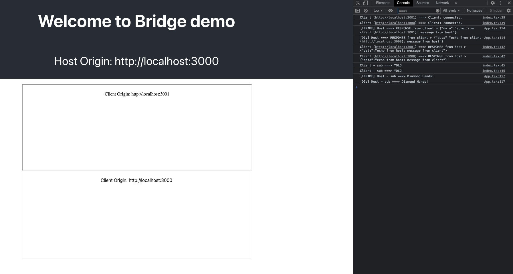

# Bridge

## What is Bridge?
Bridge is a front-end library provide developer friendly protocol for cross domain (e.g iframe) communications.

## Install
```
npm i fesoa-bridge

or

yarn add fesoa-bridge
```

## How it works?

See [example](https://github.com/shrimpy/bridge/tree/main/example) folder for full working sample
- For detail instruction on how to run the example, scroll to the bottom of the README

#### 1. Load content from another domain into an iframe
```
  const iframeElement: HTMLIFrameElement = document.createElement("iframe");
  iframeElement.src = /* url to download content */;
  iframeElement.width = "100%";
  iframeElement.height = "100%";
```

#### 2. setup communication channel
```
iframeElement.onload = async (event: Event) => {
    await setupHost("IFRAME", iframeElement.contentWindow as Environment);
};

async function setupHost(name: string, client: Environment, clientOrigin: string) {
    const host = new Host(window, client, clientOrigin);

    // register any API that other side can call
    host.registerResolver(new HostSampleResolver());

    await host.setup();
}

```

### 3. client setup
```
  const client = new Client(window);

  // register any API that other side can call
  client.registerResolver(new ClientSampleResolver());

  await client.setup();
```

## Communication protocol

### Two way communication
```
const response = await host.invokeResolver<string>("ClientSampleResolver", "echo", { message: "message from host" });

// or

const response = await client.invokeResolver<string>("HostSampleResolver", "echo", { message: "message from client" });
```

```
// API implementation

class HostSampleResolver implements IResolver {
  public name: string = "HostSampleResolver";

  public echo(inputs: { message: string }, from: string): Promise<any> {
    return new Promise((resolver) => {
      setTimeout(() => {
        resolver({ data: `echo from host: ${inputs.message}` });
      }, 500);
    });
  }
}

class ClientSampleResolver implements IResolver {
  public name: string = "ClientSampleResolver";

  public echo(inputs: { message: string }, from: string): Promise<any> {
    return new Promise((resolver) => {
      setTimeout(() => {
        resolver({ data: `echo from client (${window.origin}): ${inputs.message}` });
      }, 500);
    });
  }
}
```

### One way broadcast

```
client.broadcastEvent("client-event", "Diamond Hands!");

or

host.broadcastEvent(`[${name}] host-event`, "YOLO");
```

```
  // subscribe to broadcast event

  host.subscribe("client-event", (inputs: any) => {
    console.log(`[${name}] Host - sub ===>`, inputs);
  });


  client.subscribe("host-event", (inputs: any) => {
    console.log("Client - sub ===>", inputs);
  });
```

## How to run the example
- Open two terminal and `cd` into `bridge/example/client` and `bridge/example/host`
- `yarn install` on both folder
- Ensure you install browser plugin that enabled CORS request for your browser (In real world you will configure your server to allow request from another domain)
- `yarn start` on both terminal
- You should see something like below from the Host app


